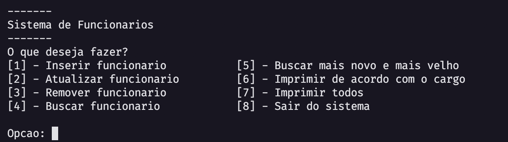
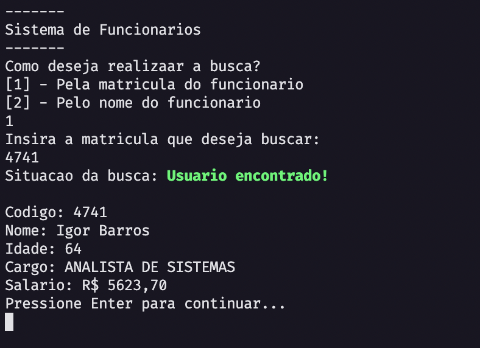
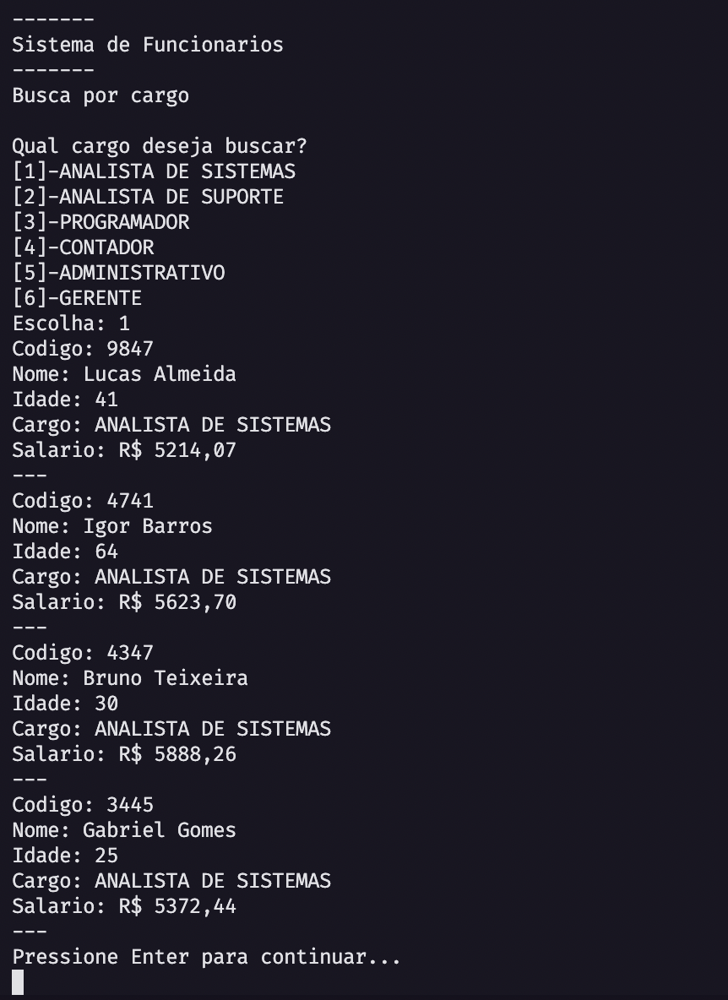

# Airport Data Structures

Aplicativo de controle de aeroporto desenvolvido como parte da disciplina de **Estrutura de Dados** no 4º semestre do curso de Engenharia da Computação da **PUC-Campinas**, ministrada pela professora **Lúcia**.

## 📚 Objetivo

Este projeto foi desenvolvido com o propósito de aplicar conceitos de estruturas de dados, em especial o uso de **filas**, para simular operações de controle de tráfego aéreo em um aeroporto.

## 👨‍💻 Integrantes

- [Guilherme Andrade](https://github.com/guiandradedev)
- [Guilherme Ximenes](https://github.com/ximeninh0)
- [Luigi Zanon](https://github.com/LuigiZanon)

## 🖼️ Demonstração

### Menu do sistema

Fonte: uso próprio (2024)

### Busca de funcionário

Fonte: uso próprio (2024)

### Impressão por cargo

Fonte: uso próprio (2024)

---

Para mais detalhes, acesse o repositório: [github.com/guiandradedev/airport-data-structures](https://github.com/guiandradedev/airport-data-structures)